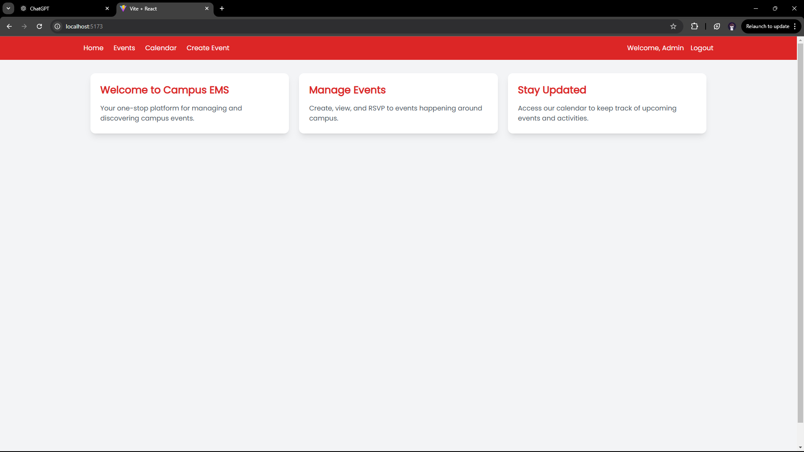
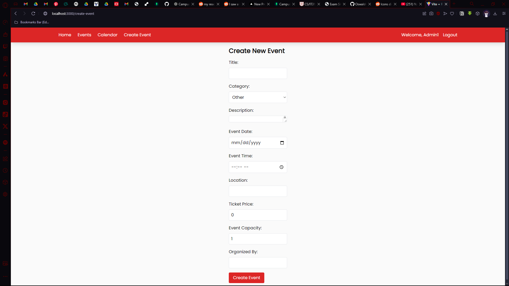
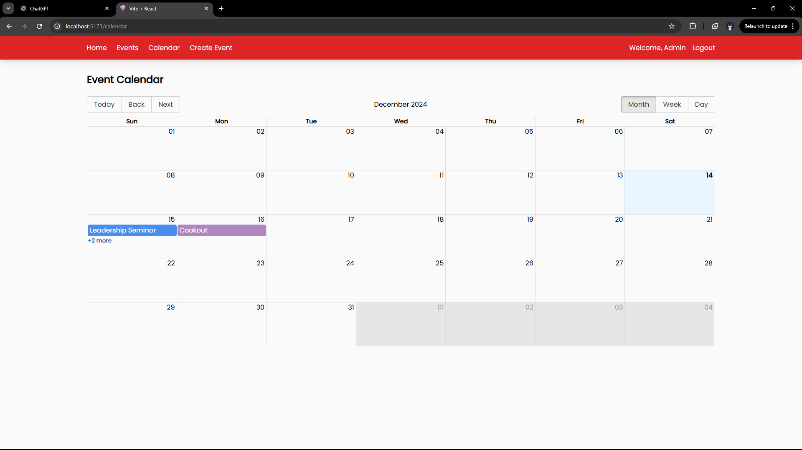
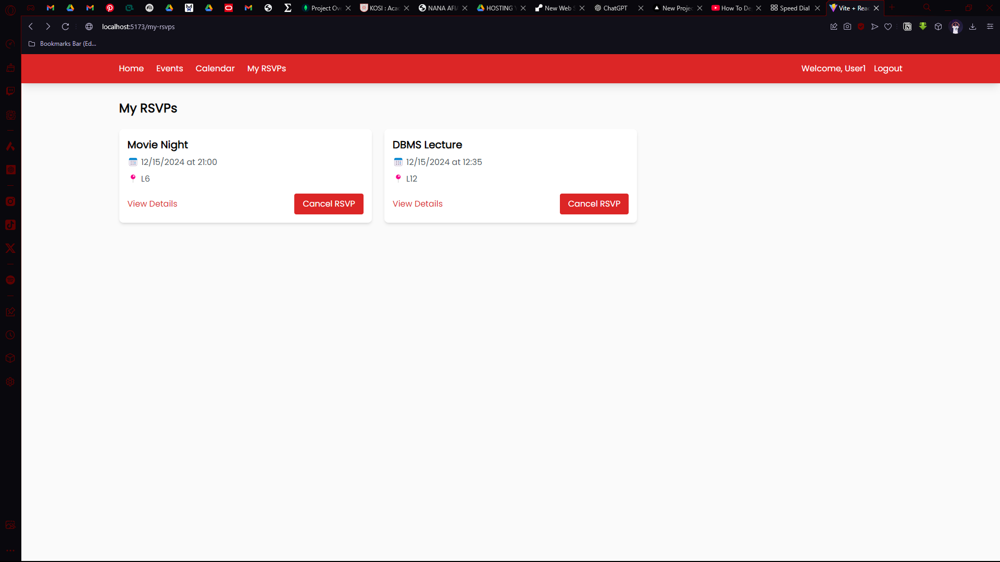
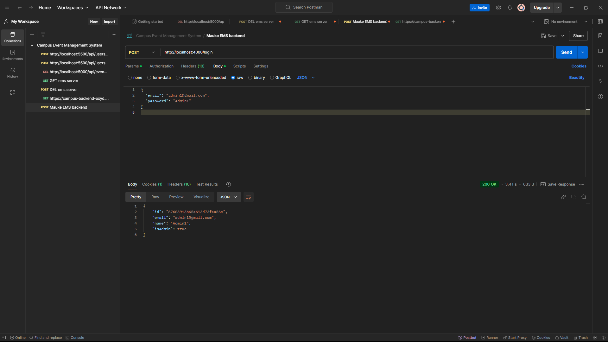
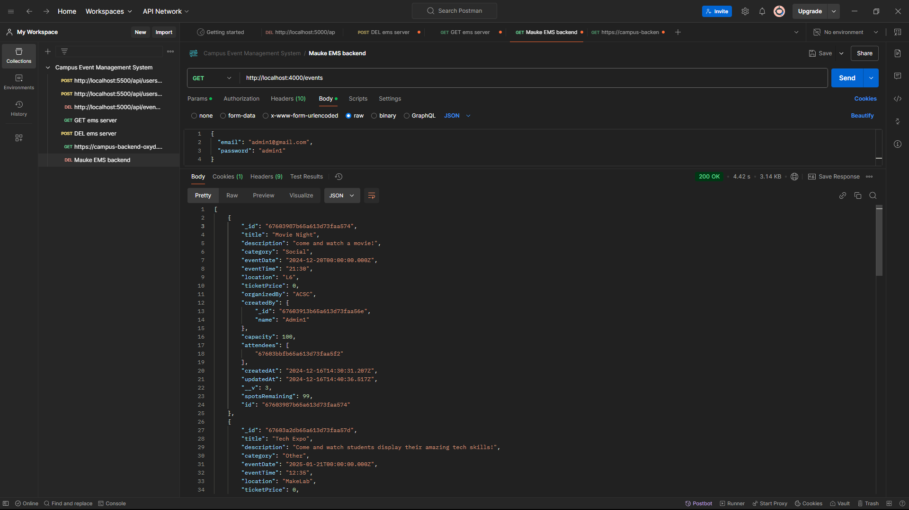
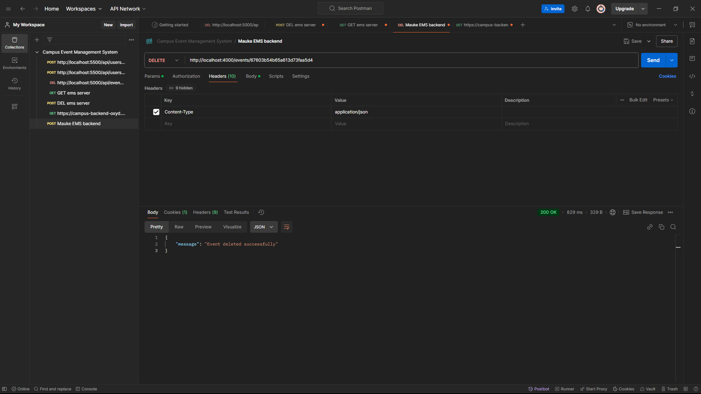

# Campus Event Management System

## (Developed for Web Technologies End of Semester Exam)

A **Campus Event Management System** that allows admins to create and manage events while enabling non-admin users to view events on a calendar and RSVP for events.

This project uses **JavaScript**, **React (with Vite)** for the frontend, and **Node.js** for the backend, along with HTML and CSS for additional structure and styling.

---
## Deployment Links:
### Frontend: https://maukecodesems.onrender.com
#### Alternative: download application folder(.zip) and run locally (steps given below)
### Backend: https://campus-backend-oxyd.onrender.com

---
## Login Credentials
### Admin:
#### Email: admin1@gmail.com
#### Password: admin1

### User:
#### Name: User1
#### Email: user11@gmail.com
#### Password: user112

---

## Features

### Admin Users:
- Log in to access admin features.
- Create events and specify capacities for events.

### Non-Admin Users:
- Log in to view available events.
- View events on the calendar.
- RSVP for events.

---

## Technologies Used

### Frontend:
- **React (Vite)**: For building the user interface.
- **HTML/CSS**: For structuring and styling the UI.
- **JavaScript**: For interactivity.

### Backend:
- **Node.js**: For the server and API logic.
- **Express.js**: For handling backend routes.
- **MongoDB**: For the database.

---

## Getting Started

Follow the steps below to set up the project locally.

### Prerequisites
Make sure you have the following installed on your system:
1. [Node.js](https://nodejs.org/)
2. npm (comes with Node.js)
3. MongoDB (if running locally) or a database connection string.

---

### Installation

#### 1. Clone the Repository:
```bash
git clone https://github.com/mauke-231/maukeCodesEMS.git
cd maukeCodesEMS
```

#### 2. Install Dependencies:

**For the Backend:**
```bash
cd ems/api
npm install
```

**For the Frontend:**
```bash
In the root folder/directory
npm install
```

---

### Running the Application

#### Backend:
Create a .env file in the backend directory with your MongoDB connection string and other configurations:
```bash
MONGODB_URI=your_mongodb_connection_string
JWT_SECRET=your_jwt_secret
```

Start the backend server:
```bash
cd ems/api
node index.js
```

The backend runs on: `http://localhost:4000` (or the configured port).

#### Frontend:
Run the frontend application:
```bash
cd maukeCodesEMS (or root directory)
npm start or serve -s build
```

The frontend runs on: `http://localhost:3000`.

---

## Directory Structure
```
maukeCodesEMS/
|-- assets/
|-- build/
|-- public/
|   |-- index.html
|-- src/
|   |-- components/
|   |-- pages/
|   |-- services/
|   |-- App.css
|   |-- App.jsx
|   |-- index.css
|   |-- index.js
|   |-- Layout.jsx
|   |-- UserContext.jsx
|-- ems/
|   |-- api/
|   |   |-- middleware/
|   |   |-- models/
|   |-- client/
|       |-- build/
|-- .eslintrc.cjs
|-- .gitignore
|-- package.json
|-- postcss.config.js
|-- tailwind.config.js
|-- vite.config.js
|-- README.md
```

---

## Screenshots
#### Homepage


#### Event Page


#### Create Event Page (Admin)


#### Calendar View


#### User RSVPs (Non-Admin)


---

## API Endpoints

### API Testing

#### Login


#### GET Events


#### DELETE Event



| Endpoint             | Method | Description                    |
|----------------------|--------|--------------------------------|
| `/events`            | GET    | Fetch all events               |
| `/users/login`       | POST   | Login                          |
| `/users/register`    | POST   | Register                       |
| `/events/:id`        | GET    | Fetch a single event by ID     |
| `/events`            | POST   | Create a new event (Admin)     |
| `/events/:id`        | PUT    | Update an event (Admin)        |
| `/events/:id`        | DELETE | Delete an event (Admin)        |
| `/rsvp/:eventId`     | POST   | RSVP to an event (Non-admin)   |
