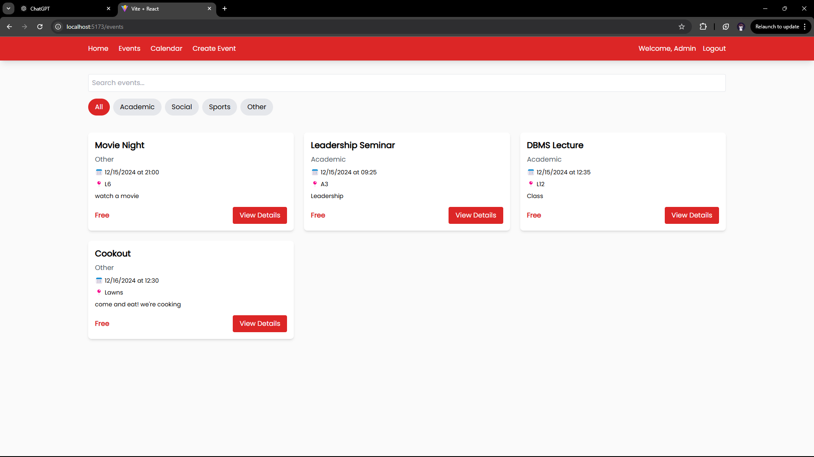

# Campus Event Management System

## (Developed for Web Technologies End of Semester Exam)

A **Campus Event Management System** that allows admins to create and manage events while enabling non-admin users to view events on a calendar and RSVP for events.

This project uses **JavaScript**, **React (with Vite)** for the frontend, and **Node.js** for the backend, along with HTML and CSS for additional structure and styling.

---
## Deployment Links:
### Frontend: (under development)
### Backend: https://campus-backend-oxyd.onrender.com

---
## Login Credentials
### Admin:
#### Email: admin1@gmail.com
#### Password: admin1

### User:
#### Name: User1
#### Email: user11@gmail.com
#### Password: user112

---

## Features

### Admin Users:
- Log in to access admin features.
- Create events and specify capacities for events.

### Non-Admin Users:
- Log in to view available events.
- View events on the calendar.
- RSVP for events.

---

## Technologies Used

### Frontend:
- **React (Vite)**: For building the user interface.
- **HTML/CSS**: For structuring and styling the UI.
- **JavaScript**: For interactivity.

### Backend:
- **Node.js**: For the server and API logic.
- **Express.js**: For handling backend routes.
- **MongoDB**: For the database.

---

## Getting Started

Follow the steps below to set up the project locally.

### Prerequisites
Make sure you have the following installed on your system:
1. [Node.js](https://nodejs.org/)
2. npm (comes with Node.js)
3. MongoDB (if running locally) or a database connection string.

---

### Installation

#### 1. Clone the Repository:
```bash
git clone https://github.com/mauke-231/maukeCodesEMS.git
cd maukeCodesEMS
```

#### 2. Install Dependencies:

**For the Backend:**
```bash
cd ems/api
npm install
```

**For the Frontend:**
```bash
cd ems/client
npm install
```

---

### Running the Application

#### Backend:
Create a .env file in the backend directory with your MongoDB connection string and other configurations:
```bash
MONGODB_URI=your_mongodb_connection_string
JWT_SECRET=your_jwt_secret
```

Start the backend server:
```bash
cd ems/api
node index.js
```

The backend runs on: `http://localhost:4000` (or the configured port).

#### Frontend:
Run the frontend application:
```bash
cd ems/api
npm start
```

The frontend runs on: `http://localhost:5173` (Vite default).

---

## Directory Structure
```
ems/
|-- client/                # Frontend code (React + Vite)
|   |-- src/
|       |-- components/    # Reusable React components
|       |-- pages/         # Page components (Home, Calendar, etc.)
|       |-- App.jsx        # Main React App component
|       |-- main.jsx       # Entry point for React
|   |-- index.html         # HTML template
|   |-- package.json       # Frontend dependencies
|
|-- api/                   # Backend code (Node.js + Express)
|   |-- models/            # Database models
|   |-- routes/            # API routes
|   |-- index.js           # Entry point for backend server
|   |-- package.json       # Backend dependencies
|
|-- README.md              # Project documentation
```

---

## Screenshots
#### Homepage


#### Event Page


#### Create Event Page (Admin)


#### Calendar View


#### User RSVPs (Non-Admin)


---

## API Endpoints

### API Testing

#### Login


#### GET Events


#### DELETE Event


| Endpoint             | Method | Description                    |
|----------------------|--------|--------------------------------|
| `/events`            | GET    | Fetch all events               |
| `/users/login`       | POST   | Login                          |
| `/users/register`    | POST   | Register                       |
| `/events/:id`        | GET    | Fetch a single event by ID     |
| `/events`            | POST   | Create a new event (Admin)     |
| `/events/:id`        | PUT    | Update an event (Admin)        |
| `/events/:id`        | DELETE | Delete an event (Admin)        |
| `/rsvp/:eventId`     | POST   | RSVP to an event (Non-admin)   |
